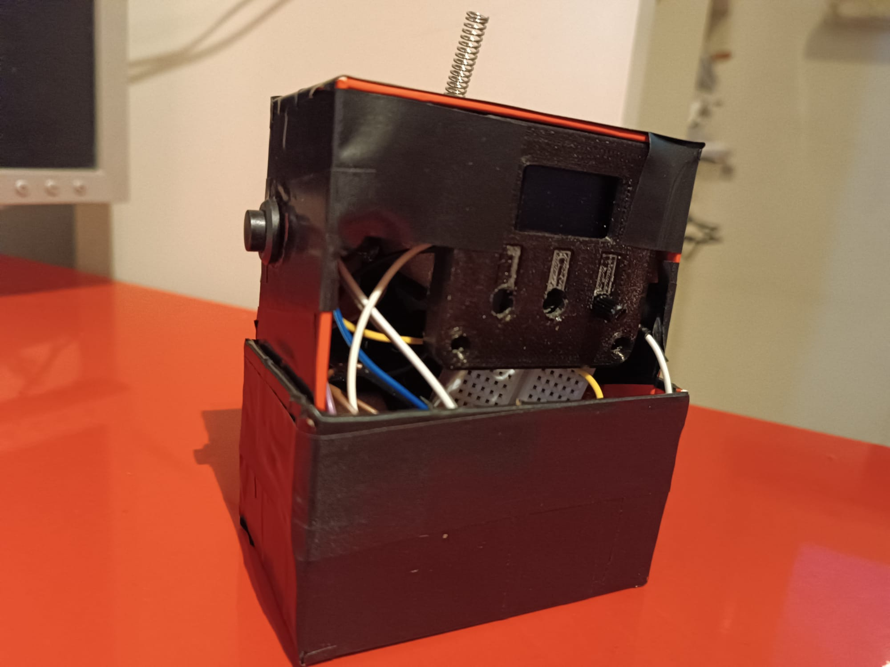
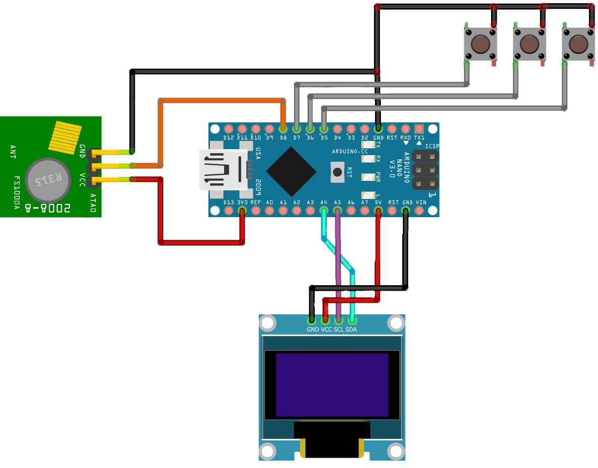
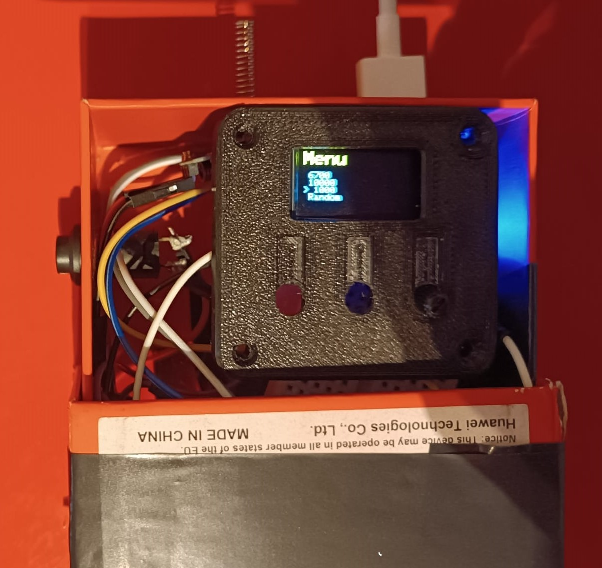

# 433mhz-Jammer
433Mhz Jammer using arduino and rf Module, with oled display and menu with options.

# 🔋 Robotics & Parts

- Arduino nano;
- Rf module 433Mhz + antenna (transmitter)
- .96 inch Oled display (i used SSD1306);
- Button (i used a switch button);
- 10k Potentiometer (can be replaced by 2 buttons);
- 3.7v Li-ion battery with case (can be replaced by any other +1.5A battery);
- Small breadboard (can be replaced by soldering shit);
- Soldering iron;
- Phone case cut in half;
   

The circuit is quite simple, as you can see on the right, i first thought of using 3 buttons but then i replaced the 2 buttons used to scroll throught the menu with a potentiometer. 

The rf module must be connected to an antenna, the one i used came unsoldered in the package, the range should technically reach 4km outdoors, 1km indoors or sum like that but i never measured it.  

As a battery i used a simple 3.7v 2amps lithium battery, because i didnt want to solder it i bought a small powerbank case and put it in there. Then it can be connected to the Nano with a simple usb-c cable (yeah it looks stupid but i hate soldering).

I also used a small breadboard to avoid soldering the potentiometer and the buttons, i also used it to connect multiple modules to the ground pin on the arduino nano, yes i hate soldering that much.

# 💻 Code

The code is a simple menu with options repeated infinitely in a loop. The display menu options are 4:
- 6700
- 1000
- 10000
- random

# 📡 RF Module
