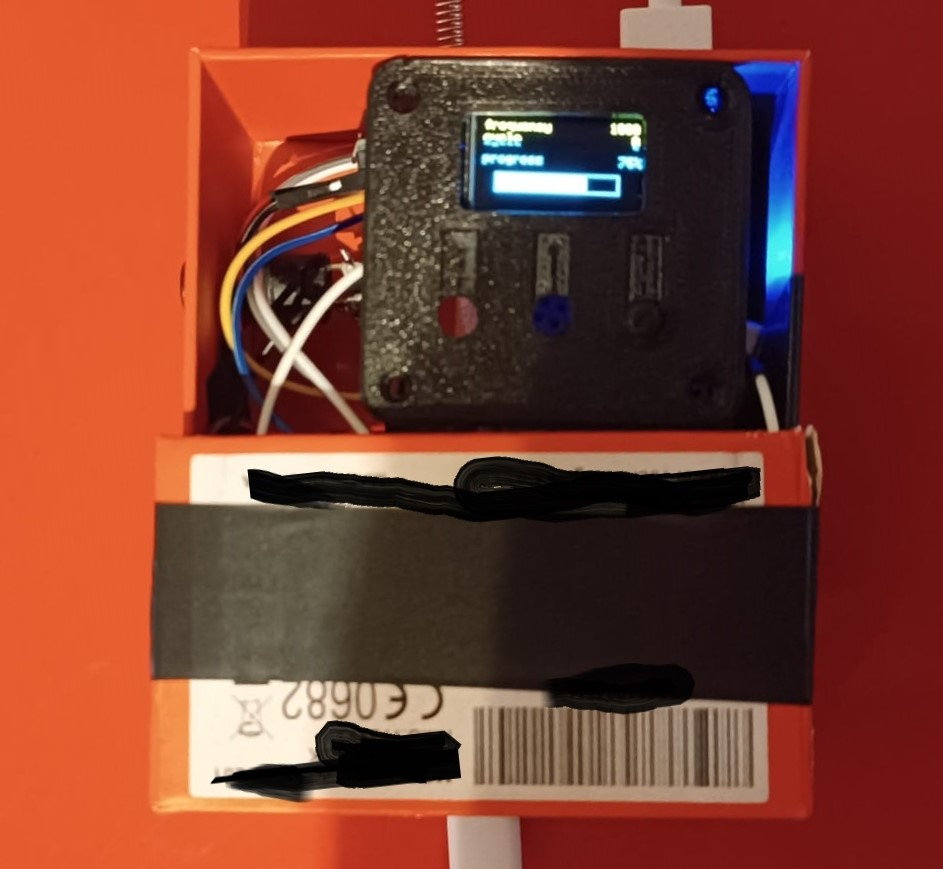

# 433mhz-Jammer
433Mhz Jammer using arduino nano and rf Module, with oled display, potentiometer and menu with options.

# 🔋 Parts & Robotics

- Arduino nano;
- Rf module 433Mhz + antenna (transmitter)
- .96 inch Oled display (i used SSD1306);
- Button (i used a switch button);
- 10k Potentiometer (can be replaced by 2 buttons);
- 3.7v Li-ion battery with case (can be replaced by any other +1.5A battery);
- Small breadboard (can be replaced by soldering shit);
- Soldering iron;
- Phone case cut in half;

The circuit is quite simple, as you can see on the right, i first thought of using 3 buttons but then i replaced the 2 buttons used to scroll throught the menu with a potentiometer. 

The rf module must be connected to an antenna, the one i used came unsoldered in the package, the range should technically reach 4km outdoors, 1km indoors or sum like that but i never measured it.  

As a battery i used a simple 3.7v 2amps lithium battery, because i didnt want to solder it i bought a small powerbank case and put it in there. Then it can be connected to the Nano with a simple usb-c cable (yeah it looks stupid but i hate soldering). 

I also used a small breadboard to avoid soldering the potentiometer and the buttons, i also used it to connect multiple modules to the ground pin on the arduino nano, yes i hate soldering that much.

# 💻 Code

The code is a simple menu with options repeated infinitely in a loop. The display menu options are 4 and you can scroll through them with the potentiometer:
- 6700;
- 1000;
- 10000;
- random;
  
The options are the band width of the attacks on the 433Mhz frequency, with a random band width option too. Once the option is selected the code is gonna load a cool animation and start the attack, which you can stop with a simple click of the button.

# 📡 RF Module

There are several kinds of modules you can buy, but they all pretty much work the same way so it doesnt matter which one u buy.

The radio module reaches 4km of distance on an open field and less than 1km indoors. You can use the transmitter to disturb applications like: car keys, garage doors, remotely opened doors, walkie talkies, any remote (except for the tv remotes which use infrared light), headphones, some radios, wireless weather stations, home security applications like alarms or doorbells, smart devices, toys like rc cars, some wireless sensors and even some health related sensors.

> [!WARNING]  
> Do not use the jammer for malicious purposes. Its illegal to jam frequencies or to disturb signals you do not own, so dont do it pls
